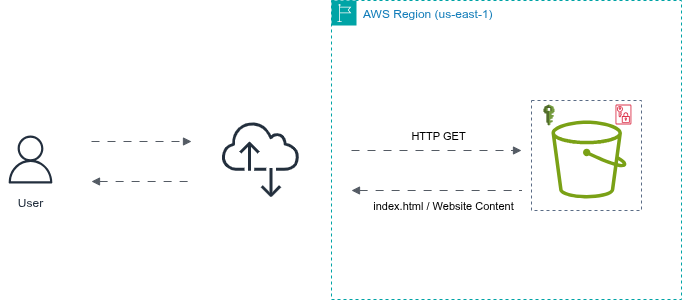

# ☁️ Portfólio Cloud - Hospedagem de Site Estático com Amazon S3

## 📝 Sobre o Projeto
Este projeto prático consiste na implantação de um site de portfólio profissional (Serverless) utilizando o **Amazon S3**. O objetivo principal foi aplicar conceitos fundamentais de infraestrutura em nuvem, gerenciamento de permissões (IAM/Bucket Policies) e hospedagem de sites estáticos de alta disponibilidade.

## 🌐 Demo do Projeto

> **Nota:** O link acima leva ao endpoint público do Amazon S3 onde o site está hospedado.

## 🏗️ Arquitetura do Projeto
**
1. O usuário acessa a URL pública (Endpoint do S3).
2. A requisição chega ao Amazon S3 (serviço regional, namespace global).
3. O S3 atua como um servidor web através do recurso "Static Website Hosting".
4. Uma Bucket Policy permite a leitura pública (`s3:GetObject`), retornando os arquivos HTML e imagens ao navegador do usuário.

## 🛠️ Tecnologias e Serviços Utilizados
* **Amazon S3:** Armazenamento de objetos e hospedagem web.
* **AWS IAM (Bucket Policies):** Controle de acesso e segurança.
* **HTML5 & TailwindCSS:** Estruturação e estilização do frontend.

## 🚀 Passo a Passo da Implementação
1. Criação de um bucket S3 com nomenclatura única global.
2. Desativação do bloqueio de acesso público (Block Public Access).
3. Upload dos arquivos estáticos (`index.html` e pasta `img/`).
4. Ativação do recurso **Static website hosting**, definindo o `index.html` como documento de índice.
5. Criação e aplicação de uma **Bucket Policy** em JSON para liberar acesso público de leitura (resolvendo o erro 403 Access Denied).

## 🔍 Troubleshooting & Aprendizados
Durante o desenvolvimento deste projeto, enfrentei e resolvi alguns desafios técnicos que me ajudaram a entender melhor o funcionamento da AWS:

* **Erro 403 Access Denied:** *O S3 é seguro por padrão e bloqueia qualquer acesso externo. Inicialmente, o site não carregava porque faltava uma permissão explícita. Resolvi o problema desativando o "Block Public Access" e configurando uma Bucket Policy em JSON para permitir a ação s3:GetObject a qualquer usuário anônimo. Isso reforçou meu entendimento sobre o modelo de segurança compartilhada da AWS.*

* **Arquivos compactados (.zip):** *Cometi o erro comum de subir as imagens dentro de um arquivo .zip. Percebi que o navegador não consegue descompactar arquivos automaticamente ao acessar um endpoint de S3; ele busca o caminho direto da imagem. Corrigi o problema extraindo os arquivos localmente e realizando o upload da pasta img/ descompactada, mantendo a integridade das referências no HTML.*

* **Case Sensitivity e Extensões:** *Identifiquei que o Amazon S3 diferencia maiúsculas de minúsculas e exige precisão nas extensões. O código HTML buscava um arquivo .jpg, enquanto a imagem no bucket era .png. Ajustei o código para garantir a concordância exata entre o arquivo referenciado e o objeto armazenado, o que resolveu o erro de carregamento das imagens.*

## 👨‍💻 Autor
**Daniel Villegas**
* Cloud Architect | AWS Certified

