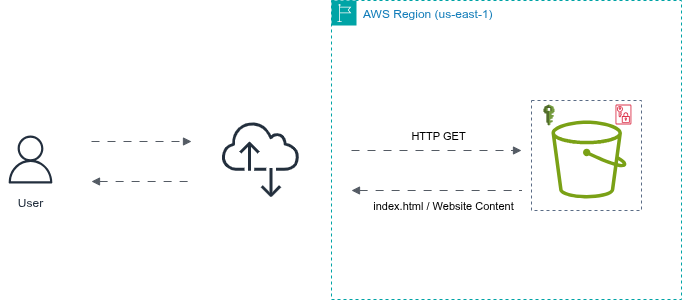
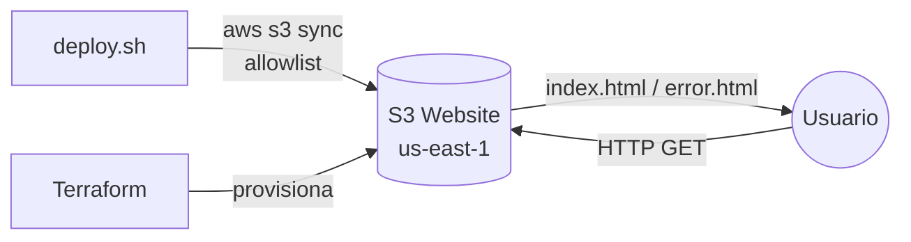

# ☁️ Portafolio Cloud: sitio estático en Amazon S3 con Terraform

[](http://proyecto-s3-website-danelvillegas-2026.s3-website-us-east-1.amazonaws.com)
[](https://www.terraform.io/)
[](https://aws.amazon.com/s3/)

Mi portafolio profesional (PT / ES / EN), hospedado en Amazon S3 con Static Website Hosting y provisionado 100% con Terraform. Empezó como proyecto de práctica y hoy es la vitrina de mis proyectos de Cloud, IaC e IA generativa en AWS.

**🌐 Demo:** http://proyecto-s3-website-danelvillegas-2026.s3-website-us-east-1.amazonaws.com

## 🏗️ Arquitectura




```mermaid
flowchart LR
    Dev[deploy.sh] -- aws s3 sync<br/>allowlist --> S3
    TF[Terraform] -- provisiona --> S3
    User((Usuario)) -- HTTP GET --> S3[(S3 Website<br/>us-east-1)]
    S3 -- index.html / error.html --> User
```

| Recurso Terraform | Función |
|---|---|
| `aws_s3_bucket` | Bucket con nombre único global |
| `aws_s3_bucket_website_configuration` | `index.html` como índice y `error.html` como página 404 |
| `aws_s3_bucket_public_access_block` | Habilita políticas públicas (solo lectura) |
| `aws_s3_bucket_policy` | `s3:GetObject` público, con el ARN referenciado dinámicamente |

## 📁 Estructura

```
├── index.html        # Sitio (HTML + CSS + i18n PT/ES/EN, sin build)
├── error.html        # Página 404 personalizada
├── img/              # Foto, certificaciones, CV y fotos de comunidad (img/comunidad/*.webp)
├── provider.tf       # Provider AWS (~> 5.0), Terraform >= 1.5
├── variables.tf      # bucket_name, aws_region, index_document
├── main.tf           # Bucket, website config, public access block, bucket policy
├── outputs.tf        # website_url, bucket_arn, bucket_name
└── deploy.sh         # Deploy seguro a S3 (prod / preview / dry-run)
```

## 🚀 Uso

```bash
# 1. Infraestructura
terraform init
terraform plan
terraform apply

# 2. Contenido
DRY_RUN=1 ./deploy.sh     # muestra qué subiría, sin tocar el bucket
./deploy.sh preview       # publica en s3://<bucket>/preview/ para revisar
./deploy.sh               # producción
```

`deploy.sh` toma el nombre del bucket de `terraform output` y sube **solo una allowlist** de archivos servibles. Así nunca se publican `terraform.tfstate`, `.terraform/` ni los `.tf`. El HTML se sube con `Cache-Control: no-cache` y los assets con 7 días de caché.

Para agregar fotos de eventos: exportar a `.webp` (≈1200px de ancho) en `img/comunidad/` con el nombre que referencia `index.html` (`aws-ug-floripa.webp`, `escola-da-nuvem.webp`, `community-day-sul-2026.webp`). Si la foto no existe, la tarjeta muestra un placeholder.

## 🔍 Troubleshooting y aprendizajes

- **403 Access Denied:** S3 es privado por defecto. Hizo falta desactivar Block Public Access *y* agregar una bucket policy con `s3:GetObject`; con solo uno de los dos el sitio no carga.
- **Endpoint REST vs. endpoint website:** `bucket.s3.amazonaws.com/index.html` sirve objetos, pero no resuelve el índice ni la página de error. El sitio debe usarse con `bucket.s3-website-<region>.amazonaws.com`.
- **Imágenes dentro de un .zip:** el navegador no descomprime archivos; los assets tienen que subirse sueltos con la misma ruta que referencia el HTML.
- **Case sensitivity:** las keys de S3 distinguen mayúsculas, minúsculas y extensión (`.jpg` ≠ `.png`).
- **Del console a IaC:** el bucket se creó primero a mano y luego se migró a Terraform; el ARN hardcodeado en la policy se reemplazó por `aws_s3_bucket.portfolio.arn`.
- **Deploy seguro:** un `aws s3 sync .` sin filtros publicaría el tfstate (que puede contener datos sensibles). Por eso el deploy usa una allowlist.

## 🗺️ Próximos pasos

- [ ] CloudFront + ACM (HTTPS) con Origin Access Control y bucket privado
- [ ] Deploy automático con GitHub Actions vía OIDC
- [ ] Backend remoto de Terraform (S3 + lockfile)

## 👨‍💻 Autor

**Daniel Villegas**: Cloud Engineer · AWS Certified (4x) · Mentor en Escola da Nuvem · AWS User Group Florianópolis

[](https://www.linkedin.com/in/vdaniel07)
[](https://github.com/DevDan7)
